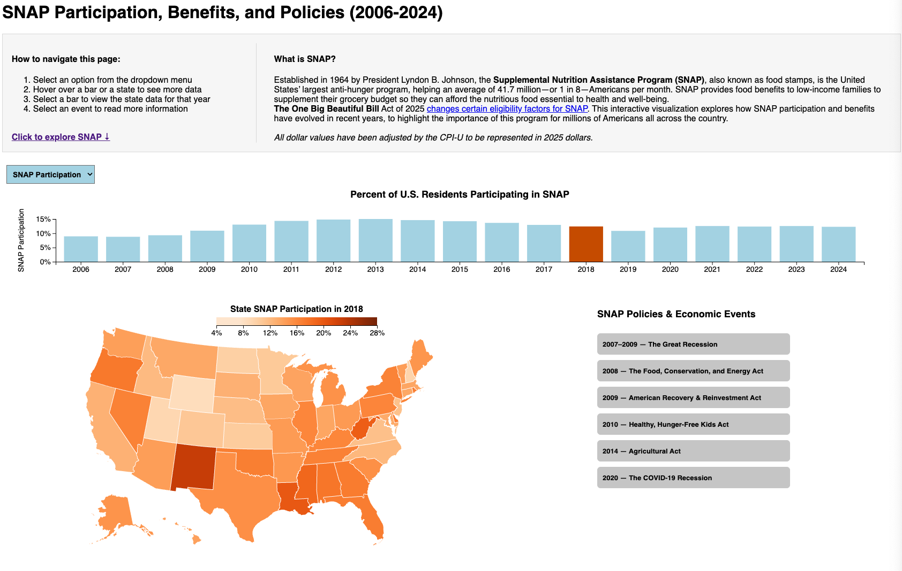

# SNAP Participation, Benefits, and Policies (2006-2024)
[Click here to interact with the report.](https://mariefarhat.github.io/interactive_viz/)

Marie Farhat

## Description

With the One Big Beautiful Bill Act of 2025, new changes will affect the future of the Supplemental Nutrition Assistance Program (SNAP). SNAP helps nearly 42 million Americans a month fight food insecurity. This project examines how SNAP participation and benefits have evolved over the last two decades to highlight it's scope and it's success as a countercyclical policy during economic downturns and expansions.

## Data Sources

**SNAP Context:**
- [What is SNAP? - Johns Hopkins University](https://publichealth.jhu.edu/2025/what-is-snap-and-why-does-it-matter#:~:text=Established%20in%201964%20by%20President,in%208%E2%80%94Americans%20per%20month)
- [SNAP - USDA Food and Nutrition Service](https://www.fns.usda.gov/snap/supplemental-nutrition-assistance-program)

**Data used for visualization and analysis:**
- [US Recessions Throughout History - Investopedia](https://www.investopedia.com/articles/economics/08/past-recessions.asp)
- [Consumer Price Index - Minneapolis FED](https://www.minneapolisfed.org/about-us/monetary-policy/inflation-calculator/consumer-price-index-1913-)
- [Population, Total for United States - St Louis FRED](https://fred.stlouisfed.org/series/POPTOTUSA647NWDB)
- [Annual Estimates of the Population for the US and States - St Louis FRED](https://fred.stlouisfed.org/release?rid=118)
- [National and State Level SNAP Data - USDA Food and Nutrition Service](https://www.fns.usda.gov/pd/supplemental-nutrition-assistance-program-snap)
- [Unemployment & Gini Coefficients - State Health Compare](https://statehealthcompare.shadac.org/)
- [Cartographic Boundary Files - United States Census Bureau](https://www.census.gov/geographies/mapping-files/time-series/geo/carto-boundary-file.html)

