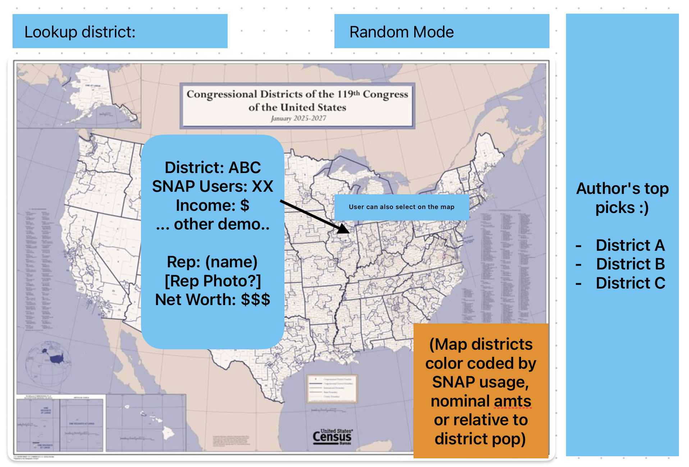

# Marie Farhat

## Description

As of early November 2025, SNAP benefits are being witheld for millions of Americans due to the ongoing government shutdown.
This project aims to present congressional districts, their SNAP usage, demographic information (particularly socioeconomic) in an interactive geospatial data visualization. The goal is for users to select a congressional disctrict (or look it up with some UI) and learn more about it and its representative. The map serves to locate the congressional district, but also show its SNAP usage relative to other ones in the country.

## Technical Plan re: Option A/B/C/D

Path C: Geospatial visualization, as the location of a lived experience can denote unwritten context and history to a reader, or prompt someone to learn more about a certain area. There's so much intangible information about a place that is hard to represent with words or numbers, and a sense of place fills that gap.

Libraries: MapLibreGL (mapping)
Other python libraries for data prep (pandas, geopandas, requests...)

Inspiration: 
https://www.fns.usda.gov/data-research/data-visualization/snap-community-characteristics-congressional-district-dashboard
There's some level of interactivity however I feel this page is a bit cumbersome and the interactivity doesn't actually work (you can select a random bar from a chart and it does nothing). Using this as a source of data inspiration, I want to create something more like:
https://www.tomforth.co.uk/circlepopulations/
I have a lot of fun with this tool, and enjoy how it lets the user drive while still providing  contextual data (bus/train stops...).

## Mockup

## Data Sources

### Data Source 1: Bi-Annual (January and July) State Project Area/County Level Participation and Issuance Data

URL: https://www.fns.usda.gov/pd/supplemental-nutrition-assistance-program-snap

Size: 2500 rows, 8 columns

Description: shows SNAP recipient count (individual and household) by county for that file's year (2024)

### Data Source 2: American Community Survey

URL: https://www.census.gov/data/developers/data-sets/acs-5year.html

Size: TBD (rows x years dating back either 5 years or ACS inception)
5-10 columns (depending on what I use from the API for demography)

Description: "The American Community Survey (ACS) is an annual survey by the U.S. Census Bureau that collects demographic, social, economic, and housing data from a sample of the population, providing up-to-date information for communities."
I plan to match the ACS data to the county SNAP data (source 1) and introduce demographic data (population density, age distribution, sex, race, housing occupancy, income, etc.).

### Data Source 3: Cartographic Boundary Files - Shapefile (County / County within Congressional District / Congressional District)

URL: https://www.census.gov/geographies/mapping-files/time-series/geo/carto-boundary-file.html

Size: <1.0MB (using 20m = 1:20,000,000 resoltion)

Description: The cartographic boundary files are simplified representations of selected geographic areas from the Census Bureau’s MAF/TIGER geographic database. These boundary files are specifically designed for small scale thematic mapping. The cartographic boundary files are available in shapefile and KML format.  A shapefile is a geospatial data format for use in geographic information system (GIS) software. For KML versions of these files, please see our Cartographic Boundary Files - KML page.  

To be used for geospatial analysis. Planning to use the Congressional District shapes however may need to also use the county hybrid one for ACS data.

### Data Source 4: Congress Personal Finances (Net Worth - 2018)

URL: https://www.opensecrets.org/personal-finances

Size: 535 rows x 3 cols

Description: Congress members' net worth data. To be used to contextualize socioeconomic data for their congressional district (broad) and SNAP recipients.
